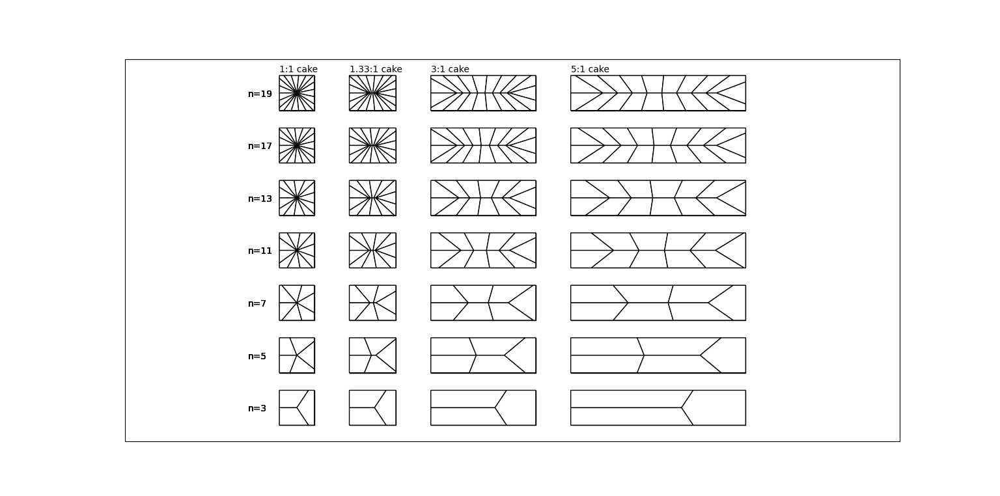

# cake-slice
Slices any rectangular prism into n slices of equal volume and outer surface area. For example, slice any cake into n slices of equal size and icing.

*"Cakes" of various side ratios cut into n slices and viewed from the top. Each slice has equal volume and equal amount of "icing" (e.g. the outer surface area of each slice is equal).*